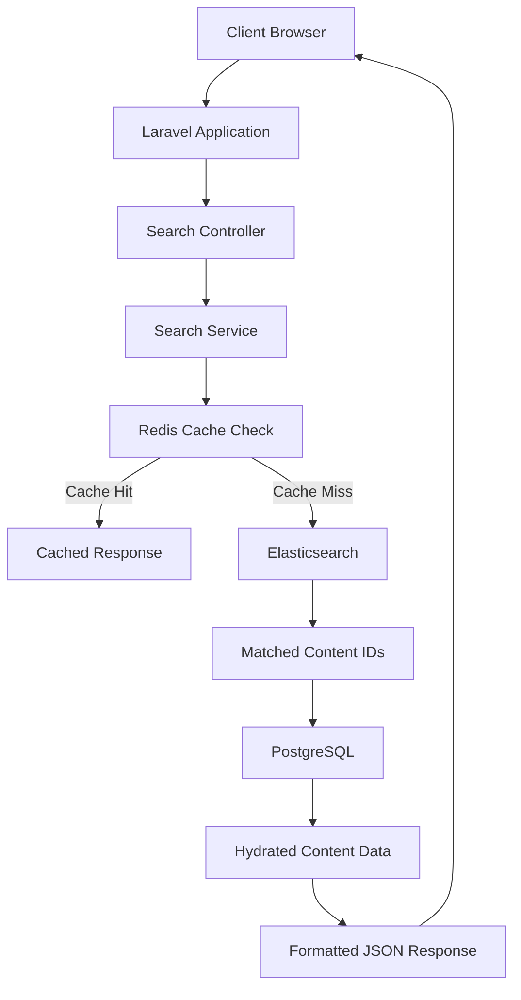
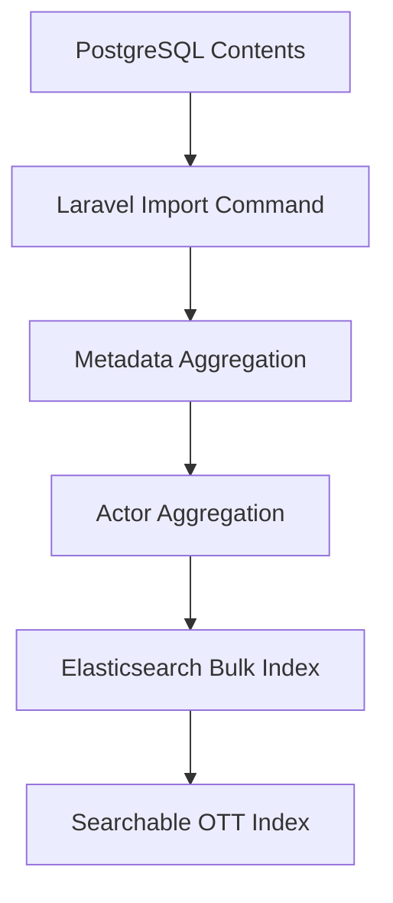
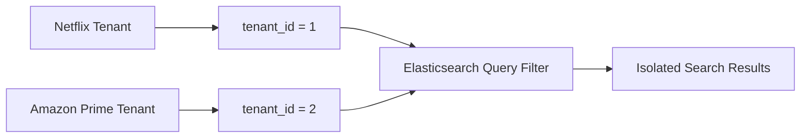
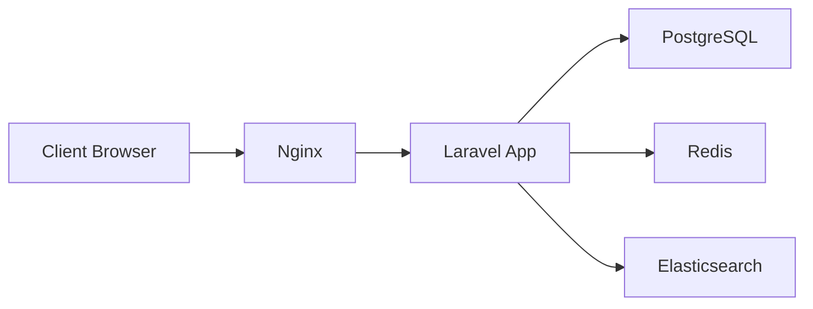
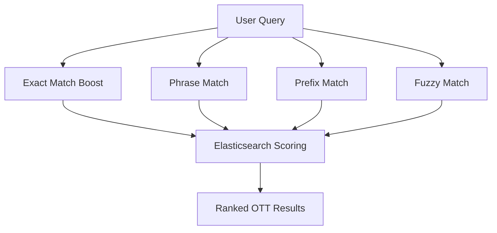

# MUVI OTT Search Platform — Architecture Diagram

## Search Request Flow

---

## Elasticsearch Indexing Flow

---

## Multi-Tenant Search Isolation

---

## Docker Infrastructure

---

## Search Relevance Strategy

